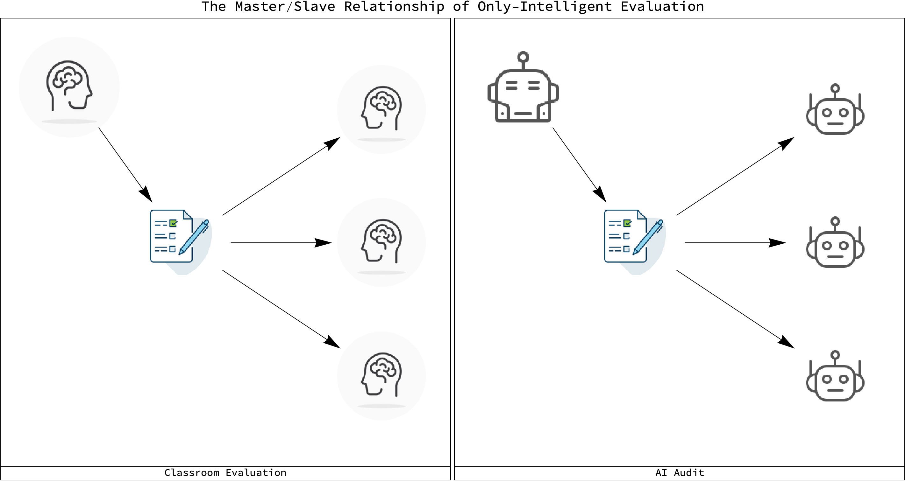
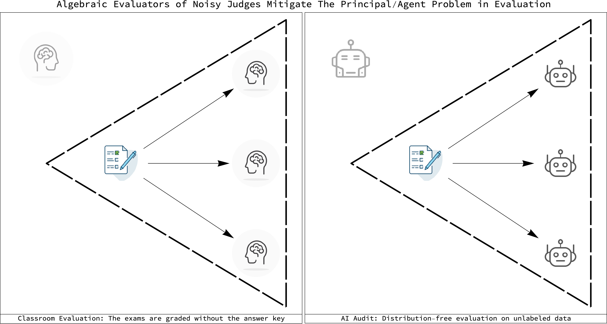

# Introduction To Algebraic Evaluation

Algebraic evaluation is the grading of noisy of judges on unlabeled data via
purely algebraic approaches. These algebraic approaches do not require the use
of probability theory or detailed knowledge of the domain in which the judges
are working.

Evaluation is the forgotten twin of learning. AI researchers and their work
currently focuses on just one side of the learning process - training. As such,
they have missed many of the benefits of algebraic evaluation. This repository
means to correct that by providing code and instruction on the mathematics and
engineering of algebraic evaluators.

## Why purely algebraic evaluation?

Because it will make us safer. The current theoretical state of AI is one
that views all tasks as solvable only by *training* methods. The 2022 NeurIPS
ML Safety Workshop is an exemplar of this exclusive theoretical focus on just
one side of learning. Evaluation and its simplicity can help make us safer.
Partly because the mathematics of evaluation is simpler than that of training.
But also from that common sense point of view we all have about safety - the
more ways you have of looking at something, the safer you are.

A safety analogy in another technological realm may clarify why this
focus on just one side of the learning problem is needlesly narrow.
Consider the humble role of thermometers in cars. Temperature thermometers
are not that smart. They just measure and output a single number. But they are
useful because they can be hooked to a car's computer and warn us that our
engine is overheating.

Where are the evaluation thermometers that can do the same for measuring the
quality of the decisions made by noisy judges? What is special about
intelligence that would prevent us from doing this? Nothing. The mathematical
theorem that is central to this work shows that there is a way around this
misconception.

## You can grade three error-indepedent binary classifiers exactly using just algebra

The core of the mathematics

## The fallacy of *only-intelligent* evaluation

Since this repository will contain code that carries out purely algebraic
evaluation of binary classifiers, it cannot be the case that the only way
we can evaluate intelligent agents is via the use of ever more
intelligent ones.

<figure>
    
    <figcaption>
    Figure Caption: <b>The fallacy of "only intelligent evaluation"</b>
    </figcaption>
</figure>

### The existential AI risk for those that believe in the fallacy

If *only-intelligent* evaluation is required, then we truly face a risky
AI future. We would be condemmed to a technological arms race with ourselves.
Faced with having to monitor AI agents on data that is unlabeled - the hard
task of evaluation upon system deployment - we would have to invent succesively
smarter AI agents to monitor stupider ones.

This is a pervese race of ``turtles all the way up''. We would be forced
to build ever smarter agents that could very well turn malicious or otherwise
threaten us. Algebraic evaluation is the way out of this trap we have made for
ourselves.

<figure>
    
    <figcaption>
    Figure Caption: <b>Bypassing the master/slave relationship of evaluation to
    make us safer.</b>
    </figcaption>
</figure>

## Guide to the repository

- **CommonMisconceptionsByAIExpertsAboutEvaluation.md**: Given the enormous
emphasis that training currently takes in the education and work life of AI
experts, it would be easy pickings to mock the many misconceptions one
encounters when discussing purely algebraic evaluation. But we would be mocking
ourselves and our journey toward understanding. Instead, this document shows
the type of questions one typically has when 1st encountering algebraic
evaluation. For example, many AI experts mistakenly assume that algebraic
evaluation is just a formulation of majority voting. This document exhibits
the evaluation formulas for majority voting versus the inferential approach of
algebraic evaluation. Assuming that algebraic evaluation is equivalent to
majority voting is the intellectual equivalent of saying that decision and
inference are the same in machine learning. Other such elementary misconceptions
are discussed in the document.

- **AlgebraicEvaluation.py**: This Python code contains basic utilities showing
how you can turn the counts of voting patterns by binary classifiers into an
algebraic formalism for carrying out perfect evaluation of binary classifiers
**IF** they are error independent in the sample. The code details all the sample
statistics that are sufficient to write down an exact representation of the
algebraic ideal associated with evaluation (the evaluation ideal).

- **EvaluationIdealAndVarietyErrorIndependentTrio.nb (and its PDF version)**:
The mathematics of algebraic evaluation is algebraic geometry. Since you are
estimating sample statistics, you get to work in a finite dimensional space
where all parameters are known. You can build exact polynomial representations
of any evaluation you care to set-up for noisy judges on unlabeled data. This
notebook shows how to do the simplest algebraic evaluation possible -
the tests where the noisy judges where independent in their errors. The almost
visceral reactions that critics of algebraic evaluation have to this "spherical
cow" in Evaluation Land is telling of the intuition that years of working in
Training Land has built up in them. All of them have most likely uttered the
phrase "consider an iid sample". In Evaluation Land we get to say "consider
noisy judges error independent on the sample". This simplest and purest of
algebraic evaluators - combining the decisions from error independent judges -
can be used to understand what algebraic evaluation can and cannot do. The
mathematics here is that of algebraic geometry. This may seem complex but if you
just read the text and enjoy the jumble of algebra, you can get a taste of what
can be accomplished by doing evaluation in a purely algebraic manner.
