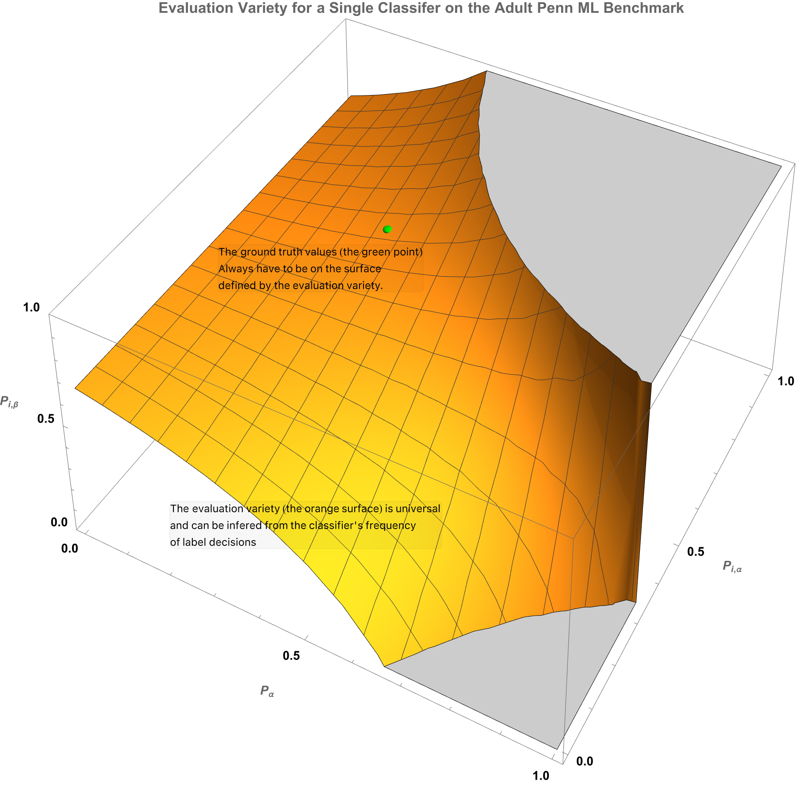

# The simplest introduction to algebraic geometry for evaluation

The machinery of algebraic geometry is complicated and mostly unfamiliar
to ML experts. This explanation is the simplest way to construct an evaluation
that can then illustrate all the relevant algebraic concepts and how they allow
us to grade noisy judges on unlabeled data.

The work that will be accomplished here can be summarized in this single image,

<figure>
    
    <figcaption>
    Figure Caption: <b>The algebraic variety of evaluation for a single binary
    classifier tested on an UCI Adult subset.</b>
    </figcaption>
</figure>

As the term itself implies, algebraic geometry connects two branches of
mathematics - algebra and geometry. More precisely - the geometry of the zeros
of polynomial ideals. The connections of this mathematics to the evaluation of
noisy judges are as follows:
1. The decisions of an ensemble allow us to collect frequency statistics on
their errorful decisions. The trivial case we will consider here (n=1!) is
already complicated on the possible statistics of the sample we may be
interested in. Let us start simple with the "point statistics" - what is the
frequency of vote patterns when we just see their decisions for a single item
on the test set. There are many more statistics beyond this we may care to probe.
Most of them remain unsolved problems in the field. My work is at the very door
of what algebraic evaluation will become. For example, we could be interested
in the error patterns when we look at the decisions of the ensemble over two
items in the test set. Algebraically it does not matter what the selection
function for a pair is. That is what makes algebra so useful for epistemic
uncertainty. Algebra has no brain. No probability distribution that models how
errorful the experiment or observation will be like. Algebra is perfect for
intelligence thermometers.
One can think of these observables as the data sketch of the decisions that
will be used to evaluate the noisy algorithms. Once you fix the decision
events you will collect from the test set, you will be able to define the
unknown statistics that explain your "surface" frequency counts.
2. The immediate consequence of just estimating sample statistics is that these are
finite once you have settled on the decision events. If you are just observing
events related to single items, as we will consider here, then there is a finite
polynomial of the unobserved evaluation statistics that will be equivalent to
the observed decision event.

## Algebraic evaluation of the trivial ensemble (n=1)

The trivial mathematical object exists in many mathematical fields. Algebraic evaluation
is the same. The ensemble consisting of one noisy algorithm is the trivial evaluation
ensemble.

1. Observable frequency of decision events: Our choice will be the simplest. We
collect the number of times the ensemble voted ("a") versus ("b"). Let us denote
that by $f_\alpha$ and $f_\beta.$
2. The number of times that the trivial ensemble voted $\alpha$ is, by definition,
equal to the number of times it was correct (the item being labeled was $\alpha$)
plus the number of times it was incorrect (the item was $\beta$). That can be
written as the exact polynomial[^1],

$$ f_\alpha = P_\alpha  P_{1,\alpha} + P_\beta  (1 - P_{1, \beta}). $$

3. We want to hammer an important point now. The polynomial above is exact and
universal. Any noisy algorithm that you test will satisfy this evaluation
polynomial exactly. No ifs and or buts about it. Evaluation polynomials, because
they just estimate sample statistics, are universal. The lack of any domain
knowledge or information in this equation is precisely its utility. Algebra is
dumb and thus universal. No epistemic ignorance in our part will ever make
this algebraic equation be wrong. There are no wrong evaluation polynomials.
This is not at all that happens in Machine Training Land. Neither I nor anyone
else will ever be able to write the universal model that explains all the
phenomena we see. Being an expert is hard. Evaluation is not. That is the
core of our insight of why algebras of evaluation could be useful. They are
dumb but universal. This is a good property to have when you must evaluate
those smarter than yourself.

[^1]: Working with sample statistics such as, $P_{1,\alpha}$, the frequency of
times the classifier labeled $\alpha$ items correctly, raises a possible source
of notational confusion for the reader - "'Ps'? I thought you did not use
probability theory in algebraic evaluation." We do not. This is merely a
notational convention. Any "P" variable seen here is a variable for a sample
statistic, not a pointer to some probability distribution. We could use $\phi$
instead of $P$ to denote these sample statistics if that helps you realize that we
are pointing to variables that denote the value of a sample statistic, not an
unknown probability distribution.
