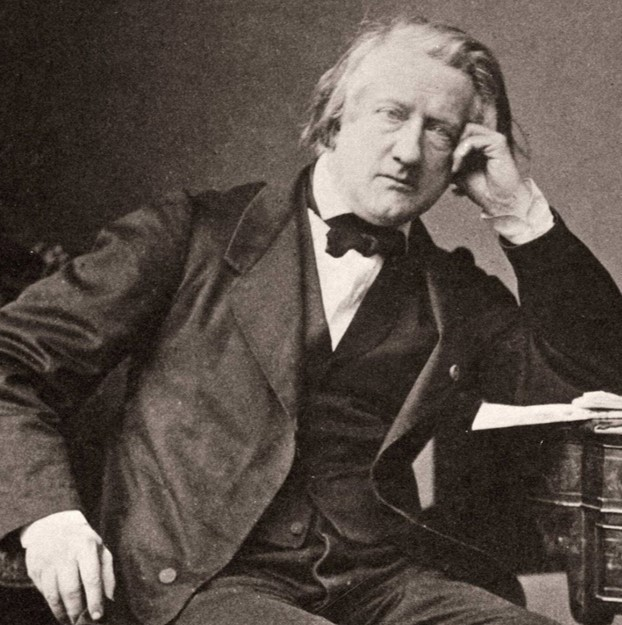
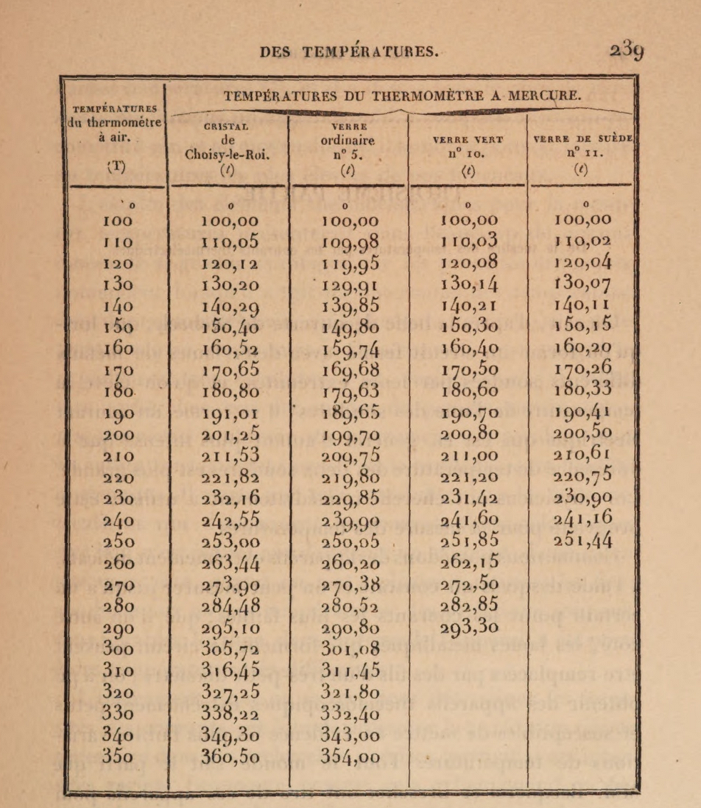
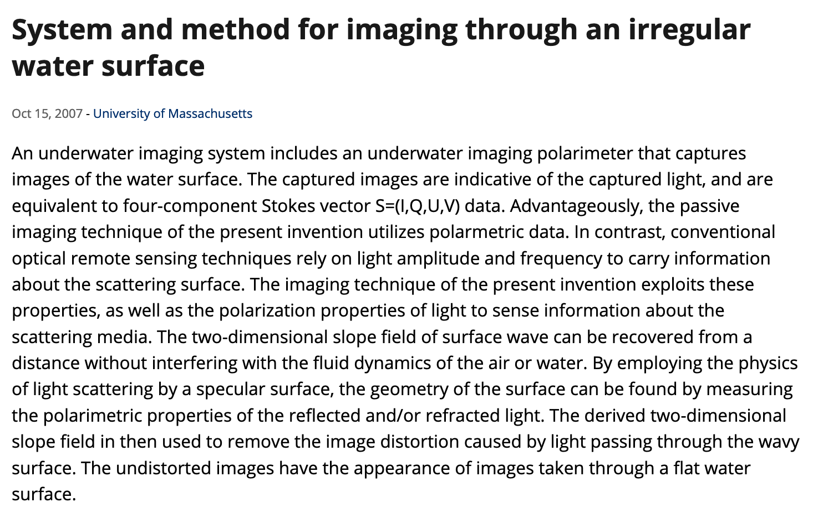

# The forgotten radical empiricism of Henri Victor Regnault

<figure>
    
    <figcaption>
    <b>A forgotten philosopher of science, a radical
    empiricist: Henri Victor Regnault</b>
    </figcaption>
</figure>

Hasok Chang has written an award winning book on measurement and scientific
progress. It is called "Inventing Temperature". In it I discovered a
forgotten luminary of 19th century empirical science - Henri Victor Regnault.
History and theory has run over his ideas. Chang resurrected them for us.
Regnault's radical empiricism is the intellectual grandfather of algebraic
evaluation. He contested the claim that is still rampant in all sciences -
we need more theory to understand our previous theory.

The similarity of this paradox - must we use more theory to check the theory
of the instrument/brain we are evaluating? - to the issue of safety from any
technology is striking. Particularly so when we amplify it by considering
the task of verifying a super intelligent being's responses to a test we gave
them. If it was on a subject they knew more about, how could we tell they are
wrong?

Regnault was working at the dawn of our understanding of atoms and certainly
very far from any ideas about statistical thermodynamics. Did he know any of
this theory to certify the precision of his instruments and his mastery of
the craftmanship it required? No. Did he need it? No.

<figure>
    
    <figcaption>
    <b>Regnault's intuition is that we should ensemble the
    opinions of noisy judges to estimate their error.</b>
    </figcaption>
</figure>

If $n$ experts disagree, at least $n-1$ must be wrong. If the truth is contested,
at least someone is not understanding it. One can look at this table and count
how many digits of agreement exist between them. We can also see which tends to
disagree most with the others, etc. We were able to tell all of that from just these
numbers. I am not even sure what all the different thermometers look like. I do
not need to. Neither do you. They disagree.

## The mathematics of Regnault's insight

Regnault basically anticipated ideas about ensembling the decisions of experts.
His insight can be made rigorous by considering the mathematics of estimating
the average error of an ensemble of regressors. We can treat each thermometer
as a noisy judge of the true value. What is the average error in their estimation
when we use it in conjunction with other noisy instruments?

I stumbled upon the algebraic solution to this problem in 2008, ignorant of
Regnault and his forgotten insights. I was working for
[Howard Schultz](http://vis-www.cs.umass.edu/~hschultz/) at
the Computer Science Department at UMass/Amherst. Schultz had hired me a year
earlier. He called me and started by saying "I have a start-up that is working
on making Diigital Elevation Models from aerial images. A map-making company."

"Stop, you had me at map-making. How can I help you?" He hired me and we worked
for a year on that failed start-up, IAVO. Schultz had trained as an oceanographer
and yet he worked at the Computer Science department. The reason was that he is
one of the pioneers of using computer vision to make maps. He has numerous patents
in the field. The one we share is this one,
[System and method for imaging through an irregular water surface ](https://patents.justia.com/patent/7630077)

<figure>
    
    <figcaption>
    <b>Using the four vector components of any light ray to
    deduce the slope of the water surface.</b>
    </figcaption>
</figure>

Howard had also conceived of and programmed a complete photogrammetric system
to make Digital Elevation Maps from aerial images, the Terrest system.
Howard was a brilliant experimentalist, a craftsman at making all his very
precise and path breaking cameras. The Navy gave him $1M to build the camera
based on the idea behind the patent we did together. And he did. He built a
beautiful camera that ended up being used on top of a really unusual platform
for oceanographic research.

All of this connects to Regnault because when you make maps or practically do
any science you face the same problems he had with his instruments - how do
I evaluate the quality of my instruments without further theory about how they
work?

## Are we doing philosophy or engineering?

Behind Regnault's empirical process there is a desire to measure or perceive
reality directly - unmediated by further theory or interpretation of what we
are observing. Chang's discussion of Regnault in his book chides
