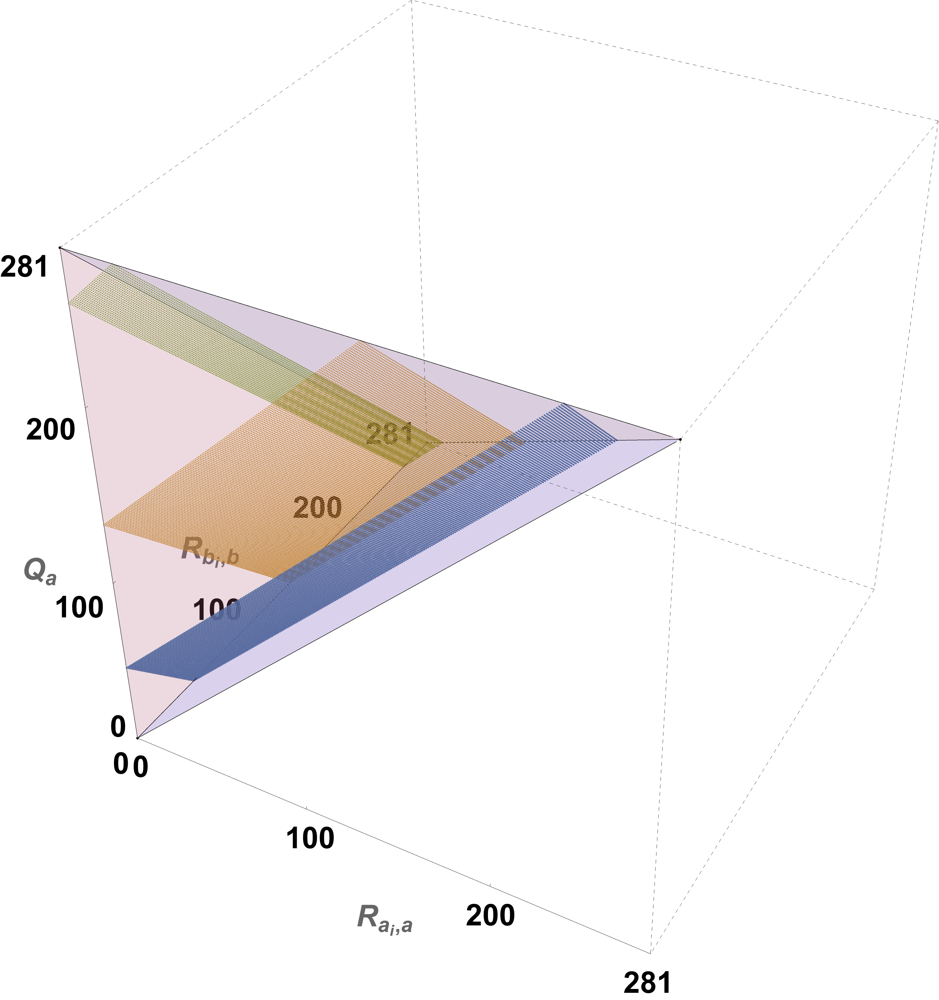

# Logic tools to make your AI safer


```console
~$: pip install ntqr
```

:::{figure-md}


**The only evaluations possible for three LLMs (Claude, Mistral, ChatGPT) that
graded a fourth one (PaLM2) doing the multistep-arithmetic test in the BIG-Bench-Mistake
dataset. Using the axiom for the single binary classifier, we can reduce each LLMs possible
evaluations as grader of the PaLM2 to the circumscribed planes inside the space of
all possible evaluations.**
:::


Evaluation of noisy decision makers in unsupervised settings is a fundamental
safety engineering problem. This library contains algorithms that treat this
problem from a logical point of view by considering the axiomatic relationships
that must govern how groups may be performing given how they agree and disagree
in their answers to a common test.

A simple demonstration of the power of logic to clarify possible group evaluations
for noisy experts is given by the example of two of them taking a common test
and disagreeing on at least one answer. We can immediately deduce that it is
impossible for **both** to be 100% correct. Notice the power of this elimination
argument. We do not need to know anything about the test or its correct answers.
By just looking at how they agree and disagree, we can immediately deduce what
group evaluations are impossible. The NTQR package carries this out by formulating
algebraic logical axioms that must be obeyed by all evaluations of a given type
or model.

Using logic as an aid for safety is well known in other industries. Formal
software verification is one requirement for certifying the software that
carries out emergency shutdowns of nuclear plants. Autonomous vehicles are
field tested using linear temporal logic.

But logic seems out of place with how we engineer AI agents nowadays,
mostly as statistical algorithms that depend and rely on a well developed set
of ideas from probability theory. In addition, for some readers it may remind
them of the symbolic AI systems that were developed before probability theory
became the basic tool for building algorithms. These used knowledge bases and
tried to reason about the world and their actions. The logic of unsupervised
evaluation we are talking about is none of those.

It is not a logic about how to make decisions. That is what the symbolic
systems try to do. They do withs using a **world model**. These are hard
define except in simulated worlds. Evaluations are not like that. A binary
test is a binary test in any domain. The logic of unsupervised evaluation
requires **evaluation models**. And these are trivial to specify and construct.

The current version is building out the axioms and logic for the case of binary
classifiers and responders (R=2) and 3-class classifiers (R=3).
The current version (v0.4) has
taken a big step by using the case of 3-class classification to go back and
rewrite the 2-class (binary) classification case. In the process, it has now
become obvious how to create an alarm for any number of classes using just
the algorithms used here that depend on just the single classifier axioms.

Brief guide:
1. Formal verification of unsupervised evaluations: The NTQR package is
  working out the logic for verifying unsupervised evaluations - what are
  the group evaluations that are consistent with how the test takers agree
  and disagree on multiple-choice exams? The page "Formal verification of
  evaluations" explains this further.
2. A way to stop infinite monitoring chains: Who grades the graders? Montioring
  unsupervised test takers raises the specter of endless graders or monitors.
  By having a logic of unsupervised evaluation, we can stop those infinite
  chains. We can verify that pairs of classifiers are misaligned, for example.
  Take a look at the "Logical Alarms" Jupyter notebook.
3. Jury evaluation theorems: Jury decision theorems - when does the crowd
  decide wisely? - go as far back as Condorcet's 1785 theorem proving that majority
  voting makes the crowd wiser for better than average jury members. The NTQR
  package contains jury evaluation theorems - when does the crowd
  evaluate itself wisely? It turns out it does this better than majority voting
  can decide. This has important consequences for how we shoud design
  safer Ai systems. Check out the "Evaluation is easier than decision"
  page.

>**Warning**
This library is under heavy development and is presently meant only
for research and educational purposes. AI or any safety engineering is
not solvable by any one tool. These tools are meant to be part of a broader
safety monitoring system and are not meant as standalone solutions.
NTQR algorithms are meant to complement, not supplant, other safety tools.

